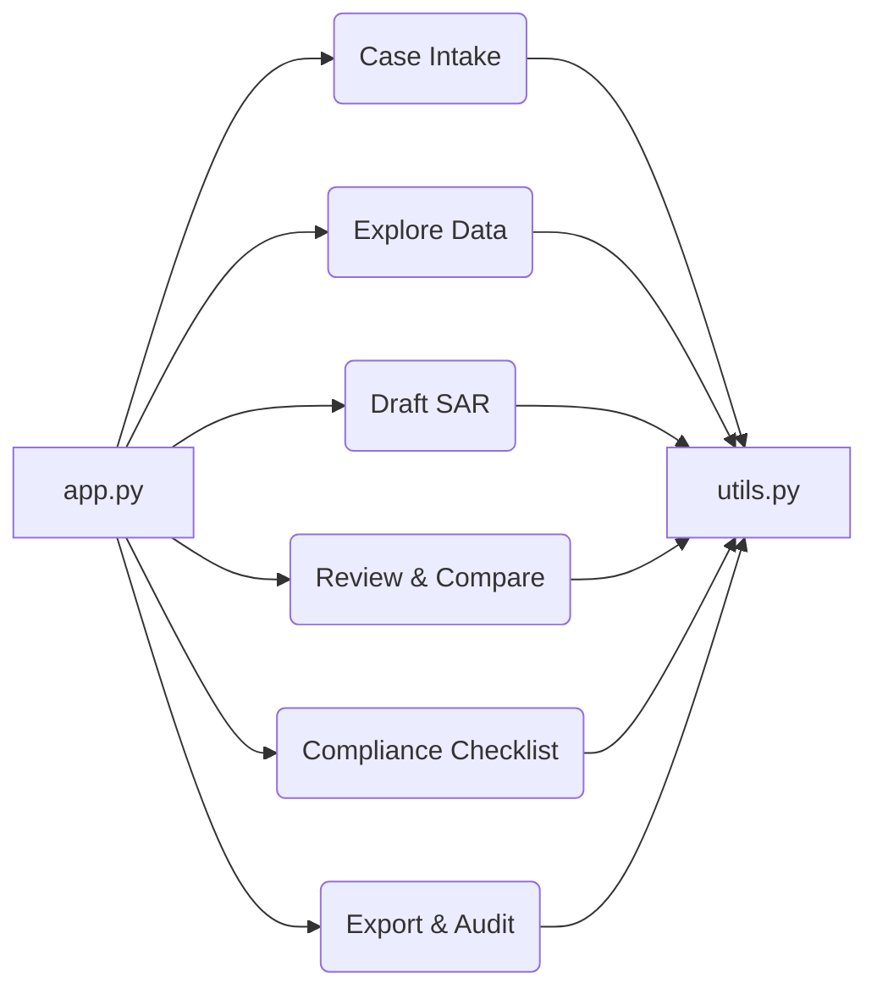

id: 68b85bb19290471499857ea8_documentation
summary: Drafting AML Suspicious Activity Reports Documentation
feedback link: https://docs.google.com/forms/d/e/1FAIpQLSfWkOK-in_bMMoHSZfcIvAeO58PAH9wrDqcxnJABHaxiDqhSA/viewform?usp=sf_link
environments: Web
status: Published
# QuLab Codelab: Streamlining AML SARs with AI

This codelab guides you through building a multi-page Streamlit application called "QuLab" designed to assist AML (Anti-Money Laundering) analysts in drafting Suspicious Activity Reports (SARs). SARs are crucial documents that financial institutions must file to report suspected instances of money laundering or other financial crimes.  QuLab leverages AI to automate the initial drafting process while ensuring human review, auditability, and compliance with regulatory guidelines. This application demonstrates how AI can augment human expertise in a critical compliance function.  The codelab emphasizes practical application and includes synthetic data generation and simulated LLM calls, making it accessible even without a pre-existing AML dataset or LLM API key.

## Codelab Overview
Duration: 00:05

This codelab will walk you through the following steps:

1.  **Setting up your Streamlit environment:**  Ensuring you have the necessary Python packages installed.
2.  **Understanding the application architecture:**  A high-level overview of how the different components of the application work together.
3.  **Exploring the "Case Intake" page:**  Loading data into the application, either from uploaded files or by generating synthetic data.
4.  **Exploring the "Explore Data" page:**  Using interactive visualizations to identify suspicious patterns in the data.
5.  **Exploring the "Draft SAR" page:**  Generating an initial SAR draft using an AI model.
6.  **Exploring the "Review & Compare" page:**  Reviewing and editing the AI-generated draft.
7.  **Exploring the "Compliance Checklist & Sign-off" page:**  Ensuring the SAR meets compliance requirements.
8.  **Exploring the "Export & Audit" page:** Exporting the final SAR and audit trail.

By the end of this codelab, you'll have a working Streamlit application that demonstrates how AI can be used to streamline the SAR drafting process.

## Setting up the Development Environment
Duration: 00:10

Before you begin, ensure you have Python installed (version 3.7 or higher) and have the following packages installed. You can install them using pip:

```bash
pip install streamlit pandas numpy plotly networkx spacy streamlit-richtext
python -m spacy download en_core_web_sm
```

<aside class="positive">
<b>Tip:</b> Using a virtual environment is highly recommended to manage dependencies for this project.
</aside>

## Application Architecture
Duration: 00:15

QuLab is structured as a multi-page Streamlit application with the following key components:

*   **`app.py`:** The main entry point of the application. It handles navigation between the different pages and initializes session state. It contains a sidebar for navigation and displays a title and introduction to the application.
*   **`application_pages/` directory:**  Contains the code for each of the individual pages in the application. This promotes modularity and makes the code easier to maintain.
*   **`application_pages/utils.py`:** Contains utility functions that are used across multiple pages, such as data loading, KPI calculation, visualization generation, and LLM prompting.

The following diagram illustrates the application's architecture:



## Case Intake Page (`application_pages/page_case_intake.py`)
Duration: 00:20

The "Case Intake" page is where you load the data that will be used to generate the SAR. It provides two options: uploading a case bundle (e.g., a CSV or JSON file) or generating synthetic data.

```python
import streamlit as st
import pandas as pd
import numpy as np
from application_pages.utils import load_synthetic_data, calculate_summary_kpis

def run_page_case_intake():
    st.header("1. Case Intake")
    st.markdown("""
    This page allows you to load case bundles, either by uploading files or by generating synthetic data.
    Once loaded, a quick summary of key metrics and potential typologies will be displayed.
    """)

    st.subheader("Load Case Data")

    # File uploader/selector for case bundles (placeholder for real implementation)
    uploaded_file = st.file_uploader("Upload Case Bundle (e.g., CSV, JSON)", type=["csv", "json"])

    if uploaded_file is not None:
        st.info("File upload functionality is a placeholder. Using synthetic data for demonstration.")
        # In a real app, parse uploaded_file and populate st.session_state.case_data
        # For now, we'll proceed with synthetic data generation.

    if st.button("Generate Synthetic Case Data"):
        with st.spinner("Generating synthetic data..."):
            synthetic_data = load_synthetic_data()
            st.session_state.customers = synthetic_data['customers']
            st.session_state.transactions = synthetic_data['transactions']
            st.session_state.alerts = synthetic_data['alerts']
            st.session_state.notes = synthetic_data['notes']
            st.session_state.case_data = synthetic_data # Store all dfs

            st.success("Synthetic data loaded successfully!")
            st.dataframe(st.session_state.transactions.head())
    
    st.divider()

    if st.session_state.transactions is not None and not st.session_state.transactions.empty:
        st.subheader("Quick Stats Display")
        kpis = calculate_summary_kpis(st.session_state.transactions)

        col1, col2, col3 = st.columns(3)
        with col1:
            st.metric(label="# Transactions", value=kpis['total_transactions'])
            st.metric(label="Total Inflow", value=f"${kpis['total_inflow']:,.2f}")
        with col2:
            st.metric(label="Total Outflow", value=f"${kpis['total_outflow']:,.2f}")
            st.metric(label="Avg Transaction Amount", value=f"${kpis['avg_transaction_amount']:,.2f}")
        with col3:
            st.metric(label="# Customers Involved", value=kpis['num_customers_involved'])
            st.metric(label="# Branches Involved", value=kpis['num_branches_involved'])

        st.markdown(f"**Time Window:** {kpis['time_window_start']} to {kpis['time_window_end']}")

        st.subheader("Possible Typologies")
        if kpis['possible_typologies']:
            for typology in kpis['possible_typologies']:
                st.info(typology)
        else:
            st.info("No specific typologies suggested based on current data.")
    else:
        st.info("No case data loaded yet. Please upload a file or generate synthetic data.")

    # Always ensure extracted_5ws is updated when data changes
    if st.session_state.case_data and st.button("Extract 5Ws from Loaded Data"):
        from application_pages.utils import extract_5ws
        st.session_state.extracted_5ws = extract_5ws(st.session_state.case_data)
        st.success("5Ws extracted and stored in session state.")
        st.json(st.session_state.extracted_5ws)
```

Key functionalities and concepts:

*   **`st.file_uploader`:**  Allows users to upload data files. Note that in this version, the file upload functionality is a placeholder, and the application proceeds directly to synthetic data generation for demonstration purposes.
*   **`load_synthetic_data()`:**  A function (defined in `utils.py`) that generates synthetic customer, transaction, alert, and notes data for testing and demonstration.
*   **`st.session_state`:**  Streamlit's built-in state management.  It's used to store the loaded data (customers, transactions, alerts, notes) so that it can be accessed by other pages in the application.
*   **`calculate_summary_kpis()`:**  A function (defined in `utils.py`) that calculates key performance indicators (KPIs) from the transaction data, such as total transaction volume, average transaction amount, and the number of unique customers involved.
*   **`extract_5ws()`:**  A function (defined in `utils.py`) that extracts the "5Ws" (Who, What, When, Where, Why) from the loaded case data.  These 5Ws are used to guide the LLM in generating the SAR narrative.
*   The page displays a summary of the loaded data, including key KPIs and possible typologies (patterns of suspicious activity).

To use this page:

1.  Navigate to the "Case Intake" page in the application.
2.  Click the "Generate Synthetic Case Data" button.
3.  Observe the summary statistics and possible typologies that are displayed.
4.  Click the "Extract 5Ws from Loaded Data" button to extract the key information from the data.

<aside class="negative">
<b>Warning:</b> The file upload functionality is a placeholder. In a real-world application, you would need to implement the logic to parse the uploaded files and load the data into `st.session_state`.
</aside>

## Explore Data Page (`application_pages/page_explore_data.py`)
Duration: 00:25

The "Explore Data" page provides interactive visualizations that allow you to explore the loaded transaction data and identify suspicious patterns.

```python
import streamlit as st
import pandas as pd
import plotly.express as px
import plotly.graph_objects as go
import networkx as nx
from application_pages.utils import (
    create_timeline_visualization,
    create_geo_map_visualization,
    create_counterparty_network_graph
)

def run_page_explore_data():
    st.header("2. Explore Data")
    st.markdown("""
    This page provides interactive visualizations to explore the loaded transaction data.
    Use the filters and slicers to narrow down your focus and identify suspicious patterns.
    """)

    if st.session_state.transactions is None or st.session_state.transactions.empty:
        st.warning("Please load case data in the 'Case Intake' page first.")
        return

    transactions_df = st.session_state.transactions.copy()

    st.subheader("Data Filters")

    col1, col2 = st.columns(2)
    with col1:
        # Date range slicer
        min_date = transactions_df['transaction_date'].min().date()
        max_date = transactions_df['transaction_date'].max().date()
        date_range = st.slider(
            "Date Range",
            min_value=min_date,
            max_value=max_date,
            value=(min_date, max_date),
            format="YYYY-MM-DD"
        )
        transactions_df = transactions_df[
            (transactions_df['transaction_date'].dt.date >= date_range[0]) &
            (transactions_df['transaction_date'].dt.date <= date_range[1])
        ]

        # Amount range slicer
        min_amount = int(transactions_df['amount'].min())
        max_amount = int(transactions_df['amount'].max())
        amount_range = st.slider(
            "Amount Range",
            min_value=min_amount,
            max_value=max_amount,
            value=(min_amount, max_amount)
        )
        transactions_df = transactions_df[
            (transactions_df['amount'] >= amount_range[0]) &
            (transactions_df['amount'] <= amount_range[1])
        ]

    with col2:
        # Channel filter
        all_channels = ['All'] + transactions_df['channel'].unique().tolist()
        selected_channels = st.multiselect("Channel", options=all_channels, default=['All'])
        if 'All' not in selected_channels:
            transactions_df = transactions_df[transactions_df['channel'].isin(selected_channels)]

        # Branch filter
        all_branches = ['All'] + transactions_df['branch_id'].unique().tolist()
        selected_branches = st.multiselect("Branch", options=all_branches, default=['All'])
        if 'All' not in selected_branches:
            transactions_df = transactions_df[transactions_df['branch_id'].isin(selected_branches)]

        # Counterparty filter
        all_counterparties = transactions_df['counterparty_id'].unique().tolist()
        selected_counterparties = st.multiselect("Counterparty", options=all_counterparties)
        if selected_counterparties:
            transactions_df = transactions_df[transactions_df['counterparty_id'].isin(selected_counterparties)]

    st.divider()

    st.subheader("Visualizations")

    # Timeline of activity
    st.plotly_chart(create_timeline_visualization(transactions_df), use_container_width=True)

    # Geo map
    st.plotly_chart(create_geo_map_visualization(transactions_df), use_container_width=True)

    # Counterparty network graph
    st.plotly_chart(create_counterparty_network_graph(transactions_df), use_container_width=True)

    # Heatmaps (day-of-week × hour-of-day deposit intensity; alert density over time)
    st.subheader("Heatmaps")
    col1, col2 = st.columns(2)
    with col1:
        st.markdown("##### Day-of-Week x Hour-of-Day Transaction Intensity")
        if not transactions_df.empty:
            transactions_df['day_of_week'] = transactions_df['transaction_date'].dt.day_name()
            transactions_df['hour_of_day'] = transactions_df['transaction_date'].dt.hour
            heatmap_data = transactions_df.groupby(['day_of_week', 'hour_of_day']).size().unstack(fill_value=0)
            
            # Ensure all days of week and hours are present
            days_order = ['Monday', 'Tuesday', 'Wednesday', 'Thursday', 'Friday', 'Saturday', 'Sunday']
            hours_order = list(range(24))
            heatmap_data = heatmap_data.reindex(days_order, axis=0).reindex(hours_order, axis=1).fillna(0)

            fig_heatmap = px.heatmap(heatmap_data,
                                     x=heatmap_data.columns, y=heatmap_data.index,
                                     title="Transaction Intensity",
                                     labels={'x': 'Hour of Day', 'y': 'Day of Week'},
                                     color_continuous_scale="Viridis")
            st.plotly_chart(fig_heatmap, use_container_width=True)
        else:
            st.info("No transaction data for heatmap.")

    with col2:
        st.markdown("##### Alert Density Over Time")
        if st.session_state.alerts is not None and not st.session_state.alerts.empty:
            alerts_df = st.session_state.alerts.copy()
            alerts_df['alert_date_only'] = alerts_df['alert_date'].dt.date
            alert_counts = alerts_df.groupby('alert_date_only').size().reset_index(name='alert_count')
            fig_alerts = px.line(alert_counts, x='alert_date_only', y='alert_count',
                                 title='Daily Alert Count',
                                 labels={'alert_date_only': 'Date', 'alert_count': 'Number of Alerts'})
            st.plotly_chart(fig_alerts, use_container_width=True)
        else:
            st.info("No alert data for alert density.")

    st.subheader("Typology Cues Panel")
    if st.session_state.case_data:
        from application_pages.utils import calculate_summary_kpis
        kpis_after_filter = calculate_summary_kpis(transactions_df)
        if kpis_after_filter['possible_typologies']:
            st.markdown("Based on the filtered data, these typologies might be relevant:")
            for typology in kpis_after_filter['possible_typologies']:
                st.warning(f"🚨 {typology}")
        else:
            st.info("No strong typology cues identified in the filtered data.")
    
    st.divider()
    st.subheader("Draft Facts Tray")
    st.markdown("""
    Clickable elements in visualizations (when implemented with custom callbacks) would add fact snippets here.
    For this prototype, use the text area below to manually add facts that you want to include in the SAR.
    """)
    new_fact = st.text_input("Add a fact to the tray:")
    if st.button("Add Fact"):
        if new_fact and new_fact not in st.session_state.draft_facts_tray:
            st.session_state.draft_facts_tray.append(new_fact)
            st.success(f"Fact '{new_fact}' added to tray.")
        else:
            st.warning("Fact is empty or already in the tray.")
    
    if st.session_state.draft_facts_tray:
        st.write("Current Facts in Tray:")
        for i, fact in enumerate(st.session_state.draft_facts_tray):
            col_fact, col_remove = st.columns([0.9, 0.1])
            with col_fact:
                st.write(f"- {fact}")
            with col_remove:
                if st.button("Remove", key=f"remove_fact_{i}"):
                    st.session_state.draft_facts_tray.pop(i)
                    st.experimental_rerun()
    else:
        st.info("No facts in the tray yet.")
```

Key functionalities and concepts:

*   **Data filtering:**  The page provides several filters that allow you to narrow down the data you want to visualize, including date range, amount range, channel, branch, and counterparty.
*   **`create_timeline_visualization()`:**  A function (defined in `utils.py`) that generates an interactive timeline visualization of transaction data, showing transaction frequency over time.
*   **`create_geo_map_visualization()`:**  A function (defined in `utils.py`) that generates a geographic map visualization of transaction origins and destinations, highlighting potential high-risk areas.
*   **`create_counterparty_network_graph()`:**  A function (defined in `utils.py`) that creates a network graph visualization of transaction counterparties, identifying key relationships and potential hubs of activity.
*   **Heatmaps:** The page includes heatmaps to visualize transaction intensity by day of the week and hour of the day, and alert density over time.
*   **Typology Cues Panel:** Based on the filtered data, the application suggests potential typologies that might be relevant to the case.
*   **Draft Facts Tray:**  A section where you can manually add facts that you want to include in the SAR narrative. In a real application, this would be populated by clicking on elements in the visualizations.

To use this page:

1.  Navigate to the "Explore Data" page in the application.
2.  Use the filters to narrow down the data you want to visualize.
3.  Explore the different visualizations to identify suspicious patterns.
4.  Add facts to the "Draft Facts Tray" that you want to include in the SAR narrative.

<aside class="positive">
<b>Tip:</b> Experiment with different filter combinations to uncover hidden patterns in the data.  Pay attention to the potential typologies suggested by the application.
</aside>

## Draft SAR Page (`application_pages/page_draft_sar.py`)
Duration: 00:15

The "Draft SAR" page is where the AI model generates the first draft of the SAR narrative.

```python
import streamlit as st
from application_pages.utils import generate_ai_narrative, extract_5ws

def run_page_draft_sar():
    st.header("3. Draft SAR")
    st.markdown("""
    On this page, an AI model will generate a first draft of the Suspicious Activity Report (SAR) narrative
    based on the loaded case data and the extracted 5Ws. Remember, this is a draft and requires human review.
    """)

    if st.session_state.case_data is None:
        st.warning("Please load case data in the 'Case Intake' page first.")
        return

    st.subheader("Extracted 5Ws (from Case Intake)")
    if st.session_state.extracted_5ws:
        for key, values in st.session_state.extracted_5ws.items():
            st.markdown(f"**{key}:** {'; '.join(map(str, values))}")
    else:
        st.info("5Ws not yet extracted. Please go to 'Case Intake' and click 'Extract 5Ws'.")

    st.divider()

    st.subheader("Generate AI-Assisted Narrative Draft")

    if st.button("Generate Draft Narrative"):
        if st.session_state.case_data and st.session_state.extracted_5ws:
            with st.spinner("Generating SAR narrative using LLM..."):
                st.session_state.ai_draft_narrative = generate_ai_narrative(
                    st.session_state.case_data, st.session_state.extracted_5ws
                )
            st.success("AI draft narrative generated!")
        else:
            st.warning("Ensure case data is loaded and 5Ws are extracted before generating the draft.")

    if st.session_state.ai_draft_narrative:
        st.subheader("AI-Generated SAR Narrative (First Draft)")
        st.text_area(
            "AI Draft Narrative",
            st.session_state.ai_draft_narrative,
            height=600,
            disabled=True,
            key="ai_draft_display"
        )
        st.markdown("""
        _**Note:** This draft is automatically passed to the 'Review & Compare' page for editing._
        """)
    else:
        st.info("Click 'Generate Draft Narrative' to produce the first draft.")
```

Key functionalities and concepts:

*   **`generate_ai_narrative()`:**  A function (defined in `utils.py`) that takes the loaded case data and extracted 5Ws as input and generates an AI-assisted SAR narrative.  This function calls the `build_prompt` and `call_llm` functions to interact with the LLM. Note that the LLM call is mocked.
*   The page displays the extracted 5Ws to provide context for the generated narrative.
*   The generated narrative is displayed in a `st.text_area` element, which is disabled to prevent accidental editing on this page.  The narrative is automatically passed to the "Review & Compare" page for editing.

To use this page:

1.  Navigate to the "Draft SAR" page in the application.
2.  Click the "Generate Draft Narrative" button.
3.  Review the generated SAR narrative.

## Review & Compare Page (`application_pages/page_review_compare.py`)
Duration: 00:20

The "Review & Compare" page is where you review and edit the AI-generated SAR narrative. It also provides a diff viewer that highlights the differences between the original AI draft and your edited version.

```python
import streamlit as st
from streamlit_richtext import richtext_editor
from application_pages.utils import highlight_changes
import datetime

def run_page_review_compare():
    st.header("4. Review & Compare")
    st.markdown("""
    On this page, you can review and edit the AI-generated SAR narrative.
    The goal is to refine the draft, ensure accuracy, and add any missing details.
    You can also compare your edits with the original AI draft.
    """)

    if not st.session_state.ai_draft_narrative:
        st.warning("Please generate a draft narrative in the 'Draft SAR' page first.")
        return

    st.subheader("Analyst Review and Edits")

    # Initialize analyst_edited_narrative if it's empty, with the AI draft content
    if st.session_state.analyst_edited_narrative == "":
        st.session_state.analyst_edited_narrative = st.session_state.ai_draft_narrative

    # Rich text editor for narrative review and edits
    edited_narrative = richtext_editor(
        "Edit SAR Narrative Here",
        value=st.session_state.analyst_edited_narrative,
        key="analyst_editor",
        height=500
    )
    
    if edited_narrative:
        st.session_state.analyst_edited_narrative = edited_narrative

    st.divider()

    st.subheader("Version Control and Audit Logging")

    if st.button("Save Analyst Edits"):
        if st.session_state.analyst_edited_narrative:
            timestamp = datetime.datetime.now().isoformat()
            # Simple hash for content (can be more robust in a real system)
            content_hash = hash(st.session_state.analyst_edited_narrative)
            audit_entry = {
                "timestamp": timestamp,
                "action": "Narrative Edited",
                "editor": "Analyst (Current User)",
                "content_hash": str(content_hash),
                "narrative_snapshot": st.session_state.analyst_edited_narrative # Store snapshot for audit
            }
            st.session_state.audit_trail.append(audit_entry)
            st.success(f"Edits saved at {timestamp}. Version tracked.")
            # Optionally, show the audit trail history
            # st.json(st.session_state.audit_trail)
        else:
            st.warning("No narrative to save.")
            
    st.markdown("""
    _**Note:** The saved version is used for compliance checks and export._
    """)

    st.divider()

    st.subheader("Diff Viewer: AI Draft vs. Analyst Edited")

    if st.session_state.ai_draft_narrative and st.session_state.analyst_edited_narrative:
        diff_html = highlight_changes(st.session_state.ai_draft_narrative, st.session_state.analyst_edited_narrative)
        st.components.v1.html(diff_html, height=600, scrolling=True)
    else:
        st.info("Generate AI draft and make edits to see the comparison.")

    st.divider()
    st.subheader("Explainability Panel (Conceptual)")
    st.markdown("""
    This panel would ideally link sentences in the narrative to specific data rows or visual selections
    that support them. For example, clicking on a sentence about a large transaction would highlight
    that transaction in the 'Explore Data' page or show its details here.

    *   **Conceptual Link:** Sentence 1 $\rightarrow$ Transaction ID: `T00123`, Amount: `\$5,000`, Date: `2022-03-15`
    *   **Conceptual Link:** Sentence 2 $\rightarrow$ Alert ID: `A0045`, Rule: `Large Cash Deposit`

    _Implementation of real-time linking requires custom Streamlit components or more complex callbacks._
    """)
```

Key functionalities and concepts:

*   **`streamlit-richtext`:** A custom component that provides a rich text editor for reviewing and editing the SAR narrative.
*   **`highlight_changes()`:** A function (defined in `utils.py`) that compares the AI-generated draft narrative with the analyst-edited version and highlights the differences between the two using `difflib`.
*   **Version control:**  The page includes a "Save Analyst Edits" button that saves the edited narrative to `st.session_state` and creates an audit trail entry. A simple hash is used to track content changes, a more robust solution could involve a full version control system.
*   **Explainability Panel (Conceptual):**  A placeholder for a feature that would link sentences in the narrative to specific data rows or visual selections that support them.  This would enhance the transparency and auditability of the SAR.

To use this page:

1.  Navigate to the "Review & Compare" page in the application.
2.  Review the AI-generated SAR narrative in the rich text editor.
3.  Edit the narrative to correct errors, add missing details, or improve clarity.
4.  Click the "Save Analyst Edits" button to save your changes.
5.  Observe the diff viewer that highlights the differences between the original AI draft and your edited version.

<aside class="negative">
<b>Warning:</b> This page requires the `streamlit-richtext` component which may have compatibility issues in some environments.  If you encounter problems, you may need to install or configure the component separately.
</aside>

## Compliance Checklist & Sign-off Page (`application_pages/page_compliance_signoff.py`)
Duration: 00:15

The "Compliance Checklist & Sign-off" page helps ensure that the drafted SAR narrative meets all regulatory compliance requirements.

```python
import streamlit as st
from application_pages.utils import run_compliance_checklist
import datetime

def run_page_compliance_signoff():
    st.header("5. Compliance Checklist & Sign-off")
    st.markdown("""
    This page helps ensure the drafted SAR narrative meets all regulatory compliance requirements.
    A checklist will validate key aspects, and a sign-off section allows for formal approval.
    """)

    if not st.session_state.analyst_edited_narrative:
        st.warning("Please review and save the narrative in the 'Review & Compare' page first.")
        return

    st.subheader("Compliance Checklist Status")

    if st.button("Run Compliance Checks"):
        if st.session_state.analyst_edited_narrative and st.session_state.extracted_5ws:
            st.session_state.compliance_checklist_results = run_compliance_checklist(
                st.session_state.analyst_edited_narrative,
                st.session_state.extracted_5ws
            )
            st.success("Compliance checks completed.")
        else:
            st.warning("Cannot run checks: narrative or 5Ws missing.")

    if st.session_state.compliance_checklist_results:
        for item, status in st.session_state.compliance_checklist_results.items():
            if status == "Pass":
                st.markdown(f"✅ **{item}:** {status}")
            elif status == "Fail":
                st.markdown(f"❌ **{item}:** <span style='color:red'>{status}</span>", unsafe_allow_html=True)
            else: # Needs Review
                st.markdown(f"⚠️ **{item}:** <span style='color:orange'>{status}</span>", unsafe_allow_html=True)
    else:
        st.info("Run compliance checks to see the results.")

    st.divider()

    st.subheader("Compliance Officer Sign-off")

    st.markdown("Ensure all compliance items are 'Pass' or 'Needs Human Review' before signing off.")

    compliance_officer_name = st.text_input("Compliance Officer Name")

    if st.button("Sign-off SAR"):
        if compliance_officer_name and st.session_state.analyst_edited_narrative:
            # Check if all critical checks are 'Pass' or 'Needs Review' (no outright 'Fail')
            all_pass_or_review = all(status != "Fail" for status in st.session_state.compliance_checklist_results.values())
            
            if not all_pass_or_review:
                st.error("Cannot sign off: Critical compliance checks have 'Fail' status. Please address them.")
            else:
                timestamp = datetime.datetime.now().isoformat()
                # Immutable hash of content
                final_content_hash = hash(st.session_state.analyst_edited_narrative)
                signoff_entry = {
                    "timestamp": timestamp,
                    "action": "SAR Sign-off",
                    "signed_by": compliance_officer_name,
                    "final_content_hash": str(final_content_hash),
                    "checklist_status_at_signoff": st.session_state.compliance_checklist_results
                }
                st.session_state.audit_trail.append(signoff_entry)
                st.success(f"SAR signed off by {compliance_officer_name} at {timestamp}.")
                st.session_state.sar_signed_off = True # Flag for export
        else:
            st.warning("Please enter the Compliance Officer's name and ensure a narrative is available.")
```

Key functionalities and concepts:

*   **`run_compliance_checklist()`:**  A function (defined in `utils.py`) that runs a compliance checklist against the narrative, verifying the presence of 5Ws, chronology, clarity, and adherence to length bounds.
*   The page displays the results of the compliance checklist, indicating whether each item has passed, failed, or needs review.
*   The page includes a "Compliance Officer Sign-off" section that allows a compliance officer to formally approve the SAR.  The sign-off process requires the compliance officer to enter their name and ensures that all critical compliance checks have passed or need review before allowing the sign-off.

To use this page:

1.  Navigate to the "Compliance Checklist & Sign-off" page in the application.
2.  Click the "Run Compliance Checks" button to run the compliance checklist.
3.  Review the results of the compliance checklist and address any items that have failed or need review.
4.  Enter the Compliance Officer's name and click the "Sign-off SAR" button to formally approve the SAR.

## Export & Audit Page (`application_pages/page_export_audit.py`)
Duration: 00:15

The "Export & Audit" page allows you to export the completed SAR narrative, supporting facts, compliance checklist report, and audit trail.

